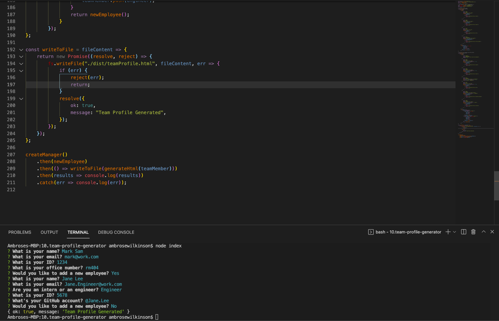
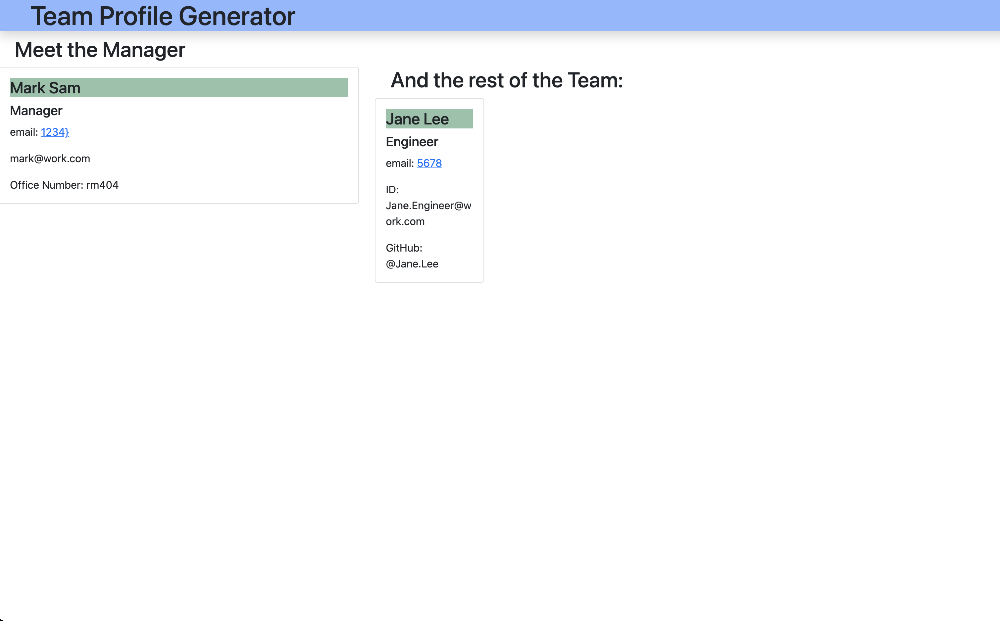

# Team Profile Generator 
  
## Description

This app creates seperate objects for three types of employees: Manager, Engineer, and Intern. Each type has seperate extenders that give them certain prompts for traits that the others don't have. Each employee object has also been tested using Jest. Once the user has inputed data for each employee an html file will be created with the information and placed into the 'dist' directory.

GitHub Repo: https://github.com/a-breezy/Team-Profile-Generator

## Table of Contents

  * [Installation](#installation-instructions)
  * [Usage](#usage)
  * [License](#license)
  * [Collaborators](#collaborators)
  * [How to Contribute](#how-to-contribute)
  * [Tests](#tests)
  * [Questions](#questions)

## Installation Instructions

Install all npm dependencies: type "npm i"

Start app: type "node index"
User will be prompted to answer questions about manager. If there are more employees you can choose to add them as well and will be prompted for their credentials.

Once user is finished adding employees their html file will be generated in the "dist" directory.

---
## Usage

*Terminal of Team Profile Generator*

*Index of Team Profile Generator*

[Link To Video Example](https://drive.google.com/file/d/18evc_D0ycuqiLp_3d_XTlrowYz6ujaH8/view)
---
## License

  [License: MIT](https://opensource.org/licenses/MIT)
  

---
## Collaborators

None

---
## How to Contribute

None

---
## Tests

After downloading dependencies create server and test locally on port 3001.

---
## Questions

ambrose.wilkins@gmail.com
